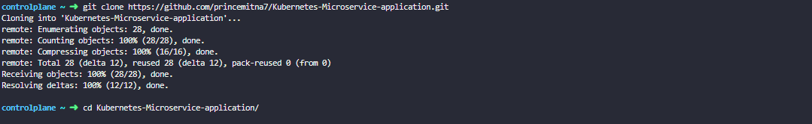
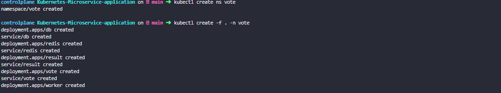
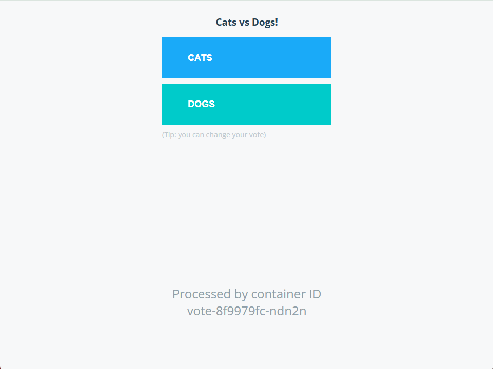
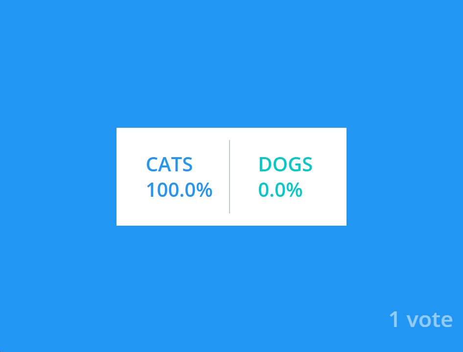

# Kubernetes Microservices Application

## 📌 Project Overview
This project demonstrates a **microservices-based application deployed on Kubernetes**.  
It includes containerized services, orchestration using Kubernetes, and command-line operations for deployment and monitoring.

---

## ⚙️ Technologies Used
- kubectl
- git

---

## 🚀 Setup & Execution

### Step 1: Run Git Commands
Below is a screenshot of the command execution:

---

### Step 2: Run Kubernetes Commands
Another command execution screenshot:

---

## 📊 Results

### Output Result 1
Result of the vote application:

---

### Output Result 2
Result after voting in result application:

---

## 👤 Author
Prince Mitna